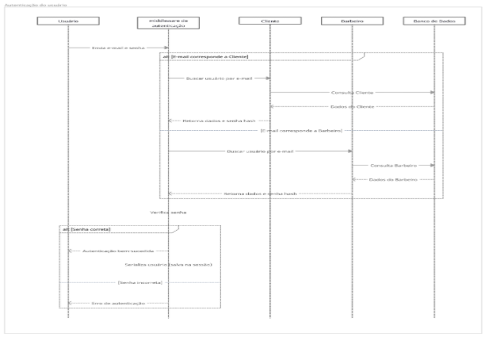

*Documento elaborado por Yasser Ibrahim Abdallah Vaz Condoluci - Março de 2024*

### GERENCIAMENTO DE BARBEARIA: utilizando metodologia ágil para desenvolvimento

## Resumo
O sistema consiste em um gerenciamento de barbearia, com o objetivo de solucionar dificuldades enfrentadas por esses estabelecimentos na administração de agendamentos de serviços, gestão de usuários e controle de estoque. A falta de soluções acessíveis e específicas para o setor resulta em uma gestão suscetível a erros, impactando negativamente no sucesso do negócio. O objetivo geral consiste no desenvolvimento de um produto de software intuitivo e acessível que integra funcionalidades de gestão com maior controle e automação de processos. Para o desenvolvimento adotou-se a metodologia ágil, permitindo a construção do sistema de forma iterativa e flexível, com melhorias contínuas baseadas no feedback e necessidades dos usuários. A solução implementada inclui autenticação de usuário, gerenciamento de agenda, notificações automáticas por serviços de mensageria, cadastro de clientes e funcionários, controle de estoque simples. Como resultado, o sistema demonstrou eficiência na otimização das tarefas diárias, reduzindo erros operacionais e aumentando a produtividade dos funcionários. Com a informatização do gerenciamento, permitiu um atendimento mais ágil e organizado, proporcionando uma experiência aprimorada para os clientes e maior organização para os funcionários. Conclui-se que a adoção de um produto software especializado contribui significativamente para o profissionalismo e competitividade das barbearias, garantindo maior controle sobre as operações e facilitando as tomadas de decisões estratégicas.

**Palavra-chave**: sistema de gerenciamento; barbearia; metodologia ágil;

## 1. INTRODUÇÃO
A necessidade de informatização e automação de processos tornam-se essenciais para negócios de todos os tamanhos. No setor de beleza masculino, que está em ascensão, muitos proprietários precisam aprimorar sua gestão para oferecer um atendimento mais eficiente e com qualidade. Apesar desse crescimento, muitas barbearias enfrentam dificuldades na gestão de agendamento, controle de estoque e gerenciamento de clientes. Essa falta de solução de software para esses processos resultam em métodos manuais, que induzem ao erro e se tornam ineficientes, podendo impactar negativamente a experiência do cliente e o sucesso do negócio.

O principal desafio é desenvolver uma solução que atenda as principais dificuldades encontradas por esses negócios em suas tarefas diárias. Sabemos que os sistemas de gerenciamento disponíveis no mercado costumam ser caros e nem sempre atendem as necessidades desse setor. Diante disso, surge a necessidade de um software de gestão acessível, intuitivo e, acima de tudo, eficiente, desenvolvido especialmente para barbearias, garantindo uma administração mais organizada e um atendimento de qualidade.

O objetivo geral é desenvolver um software de gestão para barbearias que integre as principais funcionalidades administrativas, oferecendo uma solução completa, acessível e intuitiva para proprietários e funcionários do ramo. O sistema permitirá gerenciar agendamentos de clientes, controle de estoque, armazenamento de dados de clientes.

Os objetivos específicos para o desenvolvimento do software incluem: implementar um sistema de agendamento de horários para clientes; criar um módulo de gestão que permita cadastrar, atualizar e excluir registros; permitir consulta de agendamentos; desenvolver um controle de estoque com geração de relatórios de entrada e saída; e implementar lembretes automáticos via aplicativos de mensagens.

A justificativa para o desenvolvimento deste software é a necessidade de melhorar a organização de barbearias, simplificando a gestão além de aprimorar a experiência do cliente. Com a implementação do sistema, busca-se não apenas reduzir erros e otimizar o tempo gasto em tarefas administrativas, mas também fornecer aos proprietários informações valiosas para a tomada de decisões estratégicas. Utilizando uma abordagem centrada no usuário e baseada em metodologias ágeis, o software será continuamente aprimorado a partir do feedback dos usuários, garantindo sua relevância e eficácia a longo prazo.

## 2. ESPECIFICAÇÕES INICIAIS DO SOFTWARE

### Sistema de Gestão
Software que facilita a administração de diversas atividades de um negócio, otimizando processos e centralizando informações.

### Agendamento de horários
Funcionalidade que permite marcar, alterar e cancelar compromissos de clientes com o barbeiro.

### Gestão de Clientes
Módulo responsável pelo cadastro, atualização e consulta de informações dos clientes, incluindo histórico de serviços prestados.

### Gestão de Produtos e serviços
Controle de estoque de produtos utilizados e vendidos na barbearia, bem como a definição e atualização de serviços.

### Notificações
Sistema que envia lembretes e confirmações de agendamento aos clientes via aplicativo de mensagem.

### 2.1 Escopo do Produto
O objetivo deste software é oferecer uma solução completa e eficiente para a administração de barbearias, permitindo a gestão automatizada de agendamentos, clientes, serviços e produtos.

### 2.2 Funcionalidade do Produto
- **Login/Logout**
- **Cadastro de usuários**
- **Calendário de agendamento**
- **Marcação de horários**
- **Lembretes de agendamento**
- **Catálogo de Serviços**
- **Controle de estoque**

### 2.3 Ambiente Operacional e Tecnologias
- **Back-end**: Node.Js  
- **Front-end**: HTML5, CSS3 (Bootstrap), JavaScript  
- **Autenticação**: Passport.js  
- **Banco de dados**: MongoDB  
- **Controle de versão**: Git e GitHub  

## 3. METODOLOGIA DE DESENVOLVIMENTO DE SOFTWARE
Para este projeto, será utilizada a metodologia Ágil, tendo como foco a priorização da entrega contínua de funcionalidades e a adaptação às necessidades do cliente. A metodologia permitirá que o software seja desenvolvido por meio de etapas iterativas, com revisões frequentes e ajustes baseados em feedbacks do usuário. Essa abordagem tem como objetivo reduzir riscos, identificar problemas rapidamente e garantir que o produto final seja mais adequado com as expectativas.

As atividades serão organizadas em ciclos curtos de desenvolvimento conhecidos como Sprints, com foco em entregas incrementais. Em cada sprint, as funcionalidades desenvolvidas serão testadas e validadas, permitindo a redução de erros e aprimorando a entrega de forma contínua. Esse processo iterativo promove maior controle sobre o progresso do projeto, ao mesmo tempo em que possibilita ajustes rápidos em caso de mudanças nos requisitos.

Para garantir um acompanhamento eficiente do que será desenvolvido cada sprint, será utilizada a ferramenta de gerenciamento de tarefas Trello, que facilita a visualização das atividades em andamento, concluídas e pendentes. A comunicação clara e constante entre os envolvidos no projeto será essencial para manter a transparência e assegurar que as decisões tomadas estejam sempre alinhadas com os objetivos do sistema.

## 4. DESENVOLVIMENTO

### 4.1 Módulo de Gestão de usuários

#### 4.1.1 Cadastro de Usuário
A funcionalidade de cadastro de usuário permite o registro de novos clientes ao sistema. Durante o processo de criação de conta, são solicitados poucos dados para o cadastro como nome completo, e-mail, telefone para contato e senha.

O código da imagem abaixo, é responsável pela criptografia da senha usando a biblioteca bcrypt.js e para salvar o usuário recém-cadastrado no banco de dados. No código, a constante salt gera uma string aleatória que é adicionada junto a senha antes do hashing para garantir que mesmo que duas senhas sejam iguais os hashes serão diferentes.

“Figura 1 – Trecho de código de criptografia de senha e salvamento de cadastro no banco de dados”  
Fonte: autor (2025)

#### 4.1.2 Autenticação de usuário
A funcionalidade de autenticação de usuário foi desenvolvida com o auxílio da biblioteca Passport.js utilizando a estratégia passport-local. Essa estratégia usa autenticação baseada em nome de usuário, nesse caso estou usando e-mail, e senha que são armazenadas no banco de dados do próprio sistema.

Para a autenticação, o usuário insere o seu e-mail e senha no formulário de login, os dados são submetidos ao middleware de autenticação, nesse processo o  sistema verifica as credenciais do usuário realizando uma pesquisa no banco de dados entre os clientes e caso não encontre nenhum usuário e-mail nesse modelo, será feito outra pesquisa no modelo Barbeiro. caso encontrar um usuário válido entre os dois modelos, é retornado os dados e a senha em hash para validação. Se a senha fornecida anteriormente é compatível com o hash armazenado no banco de dados, o usuário é autenticado, caso contrário é retornada uma mensagem de erro para o usuário informando erro ao tentar entrar no sistema.

Após essa autenticação bem-sucedida, é efetuado uma serialidade dos dados para iniciar uma sessão usando o ID e o tipo de usuário. E por fim é efetuado a desserialização para recuperar as informações do usuário do banco de dados para gerenciamento das permissões durante o acesso ao sistema após o login bem-sucedido. O diagrama da figura 2 é a representação do que é efetuado pelo sistema durante o processo de autenticação de login do usuário.

“Figura 2 – diagrama de sequência do módulo de autenticação de usuários”  
Fonte: autor (2025)

### 4.2 Módulo de Agendamento de Clientes
Foi desenvolvido um formulário interativo para facilitar a marcação de horários entre os clientes e os barbeiros. A funcionalidade permite realizar agendamentos personalizados, escolhendo o barbeiro de sua preferência e os serviços que ele presta, permite também escolher o melhor horário disponível, fazendo uma otimização do fluxo de atendimento da barbearia.

Durante o agendamento de serviços, o sistema realiza validações automáticas garantindo que os horários não sejam sobrepostos e que o serviço seja agendado apenas em dias e horários compatíveis com a escala de trabalho do barbeiro.

“Figura 3 – Tela de agendamento de serviços do sistema”  
Fonte: autor (2025)

### 4.3 Funcionalidades não implementadas
Durante o processo de desenvolvimento, algumas das funcionalidades citadas no início do projeto não foram concluídas dentro do prazo, principalmente devido às limitações de tempo e recursos disponíveis. Dentre as funcionalidades estão, lembrete de agendamento por aplicativos de mensageira e o controle de estoque. Apesar de não ter sido implementado nessa versão do sistema, essas funcionalidades serão desenvolvidas e implementadas em versões futuras do projeto.

## 5. CONSIDERAÇÕES FINAIS
O desenvolvimento do sistema de gerenciamento para barbearias possibilitou compreender na prática as etapas que envolvem a construção de um produto de software. A partir da identificação de um problema comum enfrentado por estabelecimentos do ramo foi possível propor uma solução específica, acessível e funcional. Com o uso da metodologia ágil, permitiu maior flexibilidade no processo de desenvolvimento, possibilitando priorizar as funcionalidades essenciais e evoluir com base em ciclos curtos e eficazes.

Durante a execução do projeto, foram implementados funcionalidades como o cadastro de clientes e funcionários, autenticação de usuários e agendamento de serviços, estruturados sob uma arquitetura MVC que garantiu organização, reusabilidade de código e facilidade de manutenção. Apesar das limitações de tempo, o escopo essencial foi entregue e validado, representando um avanço significativo na informatização de processos que eram realizados de forma manual e sujeita a erros.

Como continuidade deste trabalho, pretende-se implementar funcionalidades que ficaram de fora dessa versão, como o lembrete de agendamentos por aplicativos de mensageria e o controle de estoque. Além disso, futuras melhorias na interface e a adaptação para dispositivos móveis poderão ampliar ainda mais o alcance e a usabilidade do sistema. Com essas evoluções, acredita-se que o projeto possa ser transformado em um produto aplicável comercialmente, beneficiando pequenas barbearias que ainda não possuem ou que pretendem melhorar seu sistema de gestão.

